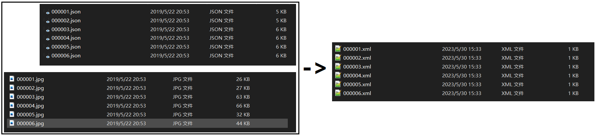

# yolov5数据准备

视频抽帧标注、剪裁物体图片、标注格式（JSON->XML）转换、yolov5数据集生成和更新。


## 使用

### 视频抽帧标注

从视频中抽帧标注，补充数据集。

由于在监控等视频中，我们关注的物体可能并不是每帧都出现，而是在某一段时间集中出现，其余大部分时间都不出现。例如，在垃圾场工作的环卫工人，在某个时间点集中作业，其余时间外出收垃圾。如果采用均匀抽帧的方式，会导致抽取大量无效、不包含目标物体的图片。因此，利用[yolov5预训练模型](https://github.com/ultralytics/yolov5/releases/tag/v5.0)，在抽帧前先判断该帧内有没有目标的物体（例如人、车），若有则抽帧，若无则继续。官方的预训练模型基于COCO数据集，标签共[80](https://zhuanlan.zhihu.com/p/263454360)个，常用的是person，当然也可以用自己预训练好的模型和权重。

**均匀抽帧用法：**

```shell
$ python video_extract_frames.py \ 
		--video_folder_path ./videos \
		--video_format .mp4 \
		--save_dir ./output \
		--save_format .jpg \
		--frame_inter 600
```

**目标检测抽帧用法：**

```shell
$ python video_extract_frames.py \ 
		--video_folder_path ./videos \
		--video_format .mp4 \
		--save_dir ./output \
		--save_format .jpg \
		--frame_inter 600 \
		--filter \
		--classes person car \
		--relationship and \
		--device cpu
```

终端打印以下类似信息：

```shell
[INFO] Options: Namespace(classes=None, conf_thres=0.25, device='cpu', filter=False, first_video=None, frame_inter=60, img_size=640, iou_thres=0.45, relationship='and', save_dir='./output', save_format='.jpg', video_folder_path='./videos', video_format='.mp4', weights='./yolov5m.pt')
[INFO] 1/3 video: suit_hat.mp4, W: 1920.0, H: 1080.0, FPS: 22.04, FC: 2360.0, Time(min): 1.78.
[INFO] Creating save_dir: ./output\suit_hat, Done.
[INFO] Frame at Time(s): 0.00/107.07 of 1/3 video: suit_hat.mp4 saved with suit_hat_0.jpg!
[INFO] Frame at Time(s): 2.72/107.07 of 1/3 video: suit_hat.mp4 saved with suit_hat_1.jpg!
···
[INFO] 3/3 video: suit_hat3.mp4, W: 1920.0, H: 1080.0, FPS: 22.04, FC: 2360.0, Time(min): 1.78.
[INFO] Frame at Time(s): 0.00/107.07 of 3/3 video: suit_hat3.mp4 saved with suit_hat3_0.jpg!
[INFO] Frame at Time(s): 2.72/107.07 of 3/3 video: suit_hat3.mp4 saved with suit_hat3_1.jpg!
...
[INFO] Frames extracting done in 0.74 min!
```

可选参数列表：

- video_folder_path：视频文件的存放位置
- video_format：指定抽取的视频文件的格式
- save_dir：抽取的图片存放位置
- save_format：抽取的图片的格式
- first_video：指定要抽取的第一个视频文件名，如6.mp4，跳过前面的视频，视频文件路径列表是通过glob读取
- frame_inter：帧间隔，每隔frame_inter帧抽取一次
- filter：使用yolov5预训练模型过滤无目标物体的帧
- classes：目标物体类别
- relationship：当有多个目标物体时，指定and/or过滤模式。and：多个目标物体都必须在帧内出现，or：多个目标物体中有一个在帧内出现
- weights：预训练权重位置
- img-size：输入图片大小
- conf-thres：置信度阈值
- iou-thres：交并比阈值
- device：模型推理设备，**目前指定为cpu**

### 裁剪物体图片

对于大图，有时我们需要裁剪出目标物体，也就是将大图变为小图，后续再训练分类模型等。例如，将监控中的环卫员的部分裁剪出来。对于裁剪出的图片，相应的XML文件也要修改并对应生成。

在命令行中调用`crop_object.py`：

```shell
$ python crop_object.py --raw_img_path ./raw_imgs/ --dst_img_path ./images/ --raw_anno_path ./raw_annos/ --dst_anno_path ./Annotations/
```

该命令的作用是：根据raw_annos里的XML文件，对raw_imgs里的图片裁剪出所有的物体，并将这些新的图片保存在images中，对应的XML文件保存在Annotations中。


可选参数列表：

- raw_img_path：大图文件夹
- dst_img_path：目标小图文件夹
- raw_anno_path：大图标注文件夹
- dst_anno_path：目标小图文件夹

### 标注格式转换

部分数据集提供的标注信息是JSON格式的，而yolov5数据集生成需要的是XML格式，XML格式也较为方便。对于JSON格式转XML格式，我们只需要读取JSON文件，并按结构创建结点，保存在XML文件里即可。

在命令行中调用`make_XML_from_JSON.py`：

```shell
$ python make_XML_from_JSON.py --json_path ./raw_json/ --anno_path ./raw_annos/ --img_path ./raw_imgs/
```

该命令的作用是：转换raw_json里的JSON文件为XML文件，保存到raw_annos里。XML文件中需要图像的w和h，因此还需要提供图片文件夹位置，这里是raw_imgs。



可选参数列表：

- json_path：JSON文件夹位置
- anno_path：目标XML文件夹位置
- img_path：图片文件夹

### 标签统计与修改

有时，我们需要对数据集标注文件中的标签进行统计，来判断标签分布是否均衡。如果分布不均衡，或者想将一些小标签合并为大标签（如：safety_hat, mesh_hat, body_hat->hat），或者有一些错误标注标签（如：cigarette写成了cigarettee），我们还需要对原始XML文件的标签（name）进行修改。

**标签统计用法：**

```shell
$ python modify_XML_label.py \ 
		--anno_path ./Annotations \
		--stats
```

终端打印以下信息：

```shell
[INFO] Options: Namespace(after_class=None, anno_path='./Annotations', before_classes=None, rename=False, stats=True)
[INFO] Count Label: 100%|██████████████████████████████████████████████████████| 5533/5533 [01:46<00:00, 51.90it/s] 
[INFO] Label stats: {'head': 90839, 'safety_hat': 1532, 'mesh_hat': 4521, 'body_hat': 611}.
```

**标签修改用法:**

```shell
$ python modify_XML_label.py \ 
		--anno_path ./Annotations \
		--rename \
		--before_classes cigarette. cigarettee cigar \
		--after_class cigarette
```

终端打印以下信息：

```shell
[INFO] Options: Namespace(after_class=cigarette, anno_path='./Annotations', before_classes=['cigarette.', 'cigarettee', 'cigar'], rename=True, stats=False)
[INFO] Rename Label: 100%|█████████████████████████████████████████████████████| 5533/5533 [01:46<00:00, 51.90it/s] 
[INFO] Label rename, Done.
```

可选参数列表：

- anno_path：XML文件位置
- stats： 统计标签
- rename：修改标签
- before_classes：需要修改的标签
- after_class：修改后的标签

### yolov5数据集生成和更新

整理数据是一个麻烦的事情，包括数据的重命名、图片与标注要匹配对应、数据划分等等。更麻烦的是，项目经常会迭代更新，补充新的数据到数据集中。而且，yolov5的标签格式是专用的，需要通过XML计算得到txt文本。为了方便解决这些问题，设置raw_img和raw_anno文件夹，也就是不管是第一次生成数据集，还是补充新数据到数据集中，把图片和标注文件（文件夹亦可）一股脑分别放到这两个文件夹中，再调用命令，选择功能，来生成或更新数据集到指定的位置。

在命令行中调用`prepare_yolo_data.py`：

```shell
python prepare_yolo_data.py --raw_img_path ./raw_imgs --raw_anno_path ./raw_annos --rename --split --label --plot --root_path ./cigarette/ --prefix /home/test/test_demo_wy/Data/cigarette/images/ --classes head cigarette --val_rate 0.05 --test_rate 0.05
```

该命令的作用是：首先将raw_imgs里包含的图片和raw_annos里包含的标注文件匹配，匹配成功后重命名，复制粘贴到cigarette/images文件夹和cigarette/Annotations文件夹中，接着对图片和标准进行划分，比例为0.9∶0.05∶0.05，划分完毕后，每个XML文件分别生成yolov5所用的label格式（只关注head和cigarette两类）。而在train.txt、val.txt、test.txt中，每条说明图片位置的记录的格式为prefix+图片名，例如/home/test/test_demo_wy/Data/cigarette/images/1.jpg。


可选参数列表：

- raw_img_path：原始（或补充）的图片文件夹
- raw_anno_path：原始（或补充）的标注文件夹
- rename：是否对图片重命名，这是考虑到原始图片可能会有重复名字，在复制粘贴到数据集位置时，可能会因为重名导致图片遗漏
- split：是否划分数据集
- label：是否将XML文件的标注信息转为yolov5所用的格式
- plot：是否在数据集生成或更新完毕后，在图片上绘制Bounding Box并保存
- plot_num：绘制Bounding Box的图片的数量
- train_rate：训练集比例
- val_rate：验证集比例
- test_rate：测试集比例
- seed：随机划分时种子
- root_path：生成后/更新时的数据集位置
- prefix：前缀，yolov5所用数据集中必须包含train.txt、val.txt、test.txt三个文本文件，里面要注明图片的位置，建议用绝对路径，因此文本文件里每个图片的位置就是prefix+图片名
- classes：XML文件可能包含多个类别信息，但我们可能只关心其中的某一些，只有这些才需要生成对应的label文本文件

## TODO

- ~~增加标签统计和标签修改的功能~~
- ~~完善数据抽帧标注代码逻辑~~
- 裁剪物体图片代码，提供生成XML文件时的信息
- 提高README文档的质量
- ···

## 更新日志

[2023/05/30] 创建Repo，更新README
[2023/06/02] 更新README，完善数据抽帧标注部分的代码逻辑，增加标注文件的标签统计与标签修改功能

## 如果本项目对您有帮助，欢迎点一个:star:！欢迎提出ISSUES，共同完善项目！